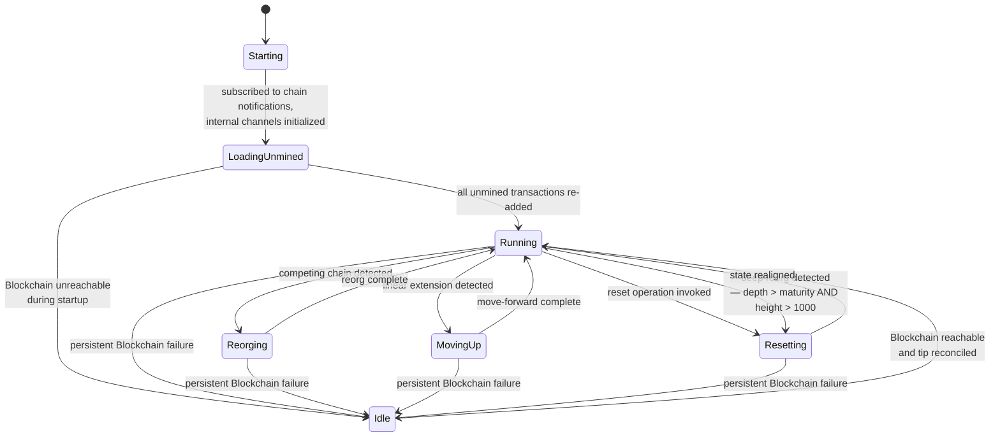
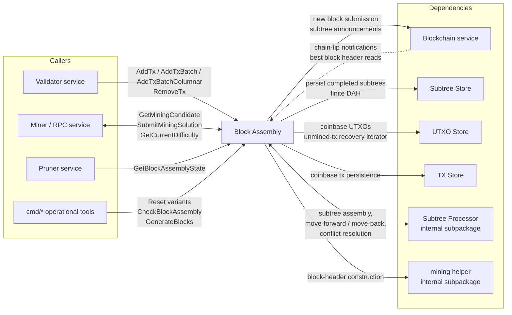
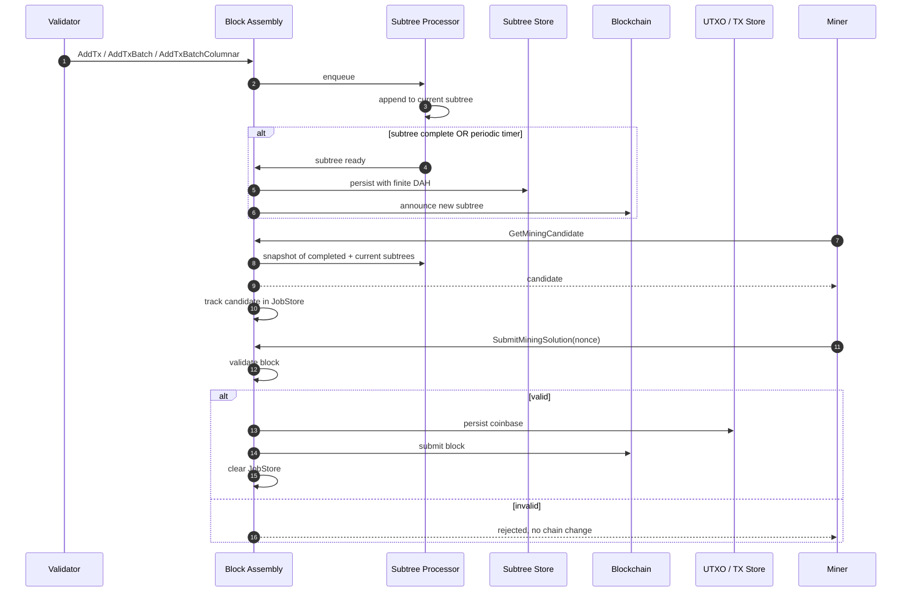
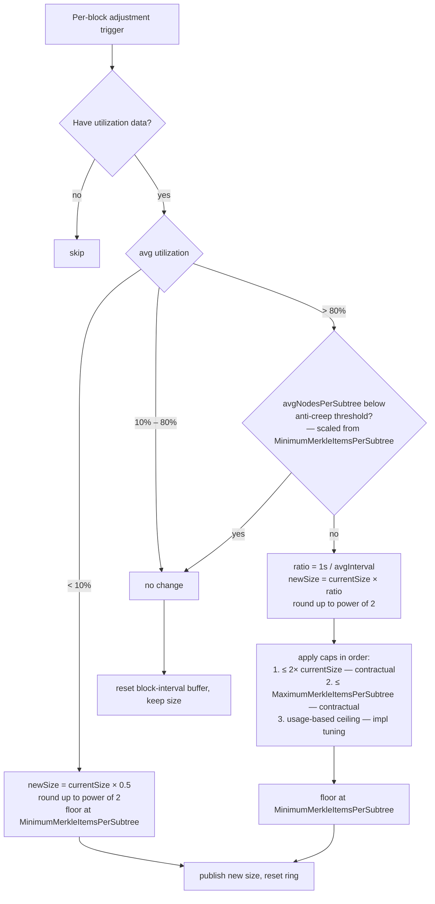
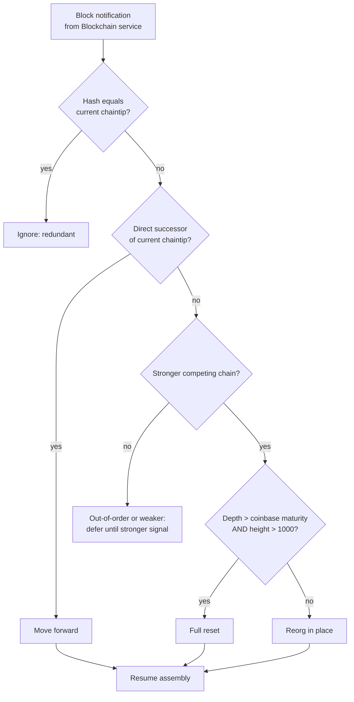

# Spec: services/blockassembly

**Status:** Draft — restructured per reviewer feedback; awaiting final human approval
**Last generated:** 2026-05-01
**Sources consulted:** package doc comments at the top of `Server.go` and `Interface.go`; `BENCHMARK.md`; `docs/topics/services/blockAssembly.md` (the canonical topic doc); RPC and message comments in `blockassembly_api/blockassembly_api.proto`; test function names across `*_test.go` for behavior signals; deep-dive reads of `Server.go`, `BlockAssembler.go`, `subtreeprocessor/SubtreeProcessor.go`, `subtreeprocessor/queue.go`, `mining/mine.go`, `mining/BuildBlockHeader.go`, `cmd/checkblockassembly`, `cmd/resetblockassembly`, `services/pruner/worker.go`, `settings/blockassembly_settings.go`, the pinned `go-subtree v1.2.0` library; chain-config defaults for `GenerateSupported` from `go-chaincfg`.
**Requirement-ID prefix:** `BA`

---

## Status and Scope

This document defines the contract that the Block Assembly service MUST conform to. It describes behavior visible to callers and observable state. It does **not** describe implementation mechanisms — those live in [Non-Normative Notes](#non-normative-notes). Known divergences between this spec and the current implementation are listed in [Conformance Gaps](#conformance-gaps); unresolved design questions are listed in [Open Questions](#open-questions).

Conformance is judged against the requirements identified by stable IDs of the form `BA-<CATEGORY>-<NNN>`. Acceptance criteria for each requirement live in the [Conformance Test Matrix](#conformance-test-matrix).

---

## Terminology

- **Subtree** — A bounded, content-addressed group of transactions with their own Merkle root, used as the unit of network broadcast and block inclusion. A block is a list of subtrees plus a coinbase transaction.
- **Mining candidate** — A potential block, complete except for the proof-of-work nonce, handed to a miner on request.
- **Coinbase placeholder** — A reserved sentinel hash occupying index 0 of the first subtree of every candidate, replaced with the actual coinbase transaction at solution-processing time.
- **Chained subtrees** — Subtrees the local node was already assembling when an externally received block arrives; treated specially during move-forward processing as an in-memory shortcut.
- **JobStore** — In-memory tracking of issued mining candidates with TTL, used to reconstruct context when a solution is later submitted.
- **DAH (Delete-At-Height)** — Height-based TTL on subtree storage; finite while in assembly, promoted to permanent (DAH=0) by the Block Persister once the containing block is persisted.
- **Move forward / move back** — Internal terms for applying a block's effects to assembly state vs. rolling them back, used during ordinary tip advance and during reorganization respectively.
- **Stable state (Pruner-visible)** — The conjunction of `BlockAssemblyState == "running"` and `CurrentHeight ≥ heightBeingPruned`. Used by the Pruner service as its safety gate.
- **Pre-computed mining data** — A snapshot of completed subtrees and derived values, atomically published whenever assembly state changes; read on the mining-candidate hot path without contention.
- **Unmined-since index** — A UTXO-store-side mark on transactions that were accepted but not yet mined, used during startup recovery to reconstitute the assembly pipeline.
- **Idle** — An operational state entered on persistent Blockchain-service unreachability, in which all state-mutating operations are rejected and the service waits for the dependency to recover.

---

## Normative Requirements

### Transaction Ingest Contract (`BA-INGEST-NNN`)

**BA-INGEST-001.** The service SHALL accept already-validated transactions from upstream callers via `AddTx`, `AddTxBatch`, and `AddTxBatchColumnar`.

**BA-INGEST-002.** The service SHALL trust that callers (canonically, the Validator service) have already performed transaction validation. The service MUST NOT perform script, signature, or policy validation of incoming transactions.

**BA-INGEST-003.** The service relies on the Validator service to never forward coinbase transactions and MUST NOT add an ingress-side rejection for coinbase transactions. Coinbase placement is enforced structurally (see BA-SUBTREE-011 / BA-SUBTREE-012), not by ingress filtering.

**BA-INGEST-004.** The service MUST reject `AddTxBatchColumnar` payloads whose parallel arrays are inconsistent. Specifically: txid array length, parent-hashes-pool length, parent-tx-offset bounds, and vout-offset bounds MUST be mutually consistent. On rejection the entire batch is rejected; no transaction within an inconsistent batch is enqueued.

**BA-INGEST-005.** The service SHALL maintain an unbounded ingest queue. The service MUST NOT impose rate-limiting, backpressure, queue-length caps, or rejection on producers. Backpressure is the upstream Validator's responsibility.

**BA-INGEST-006.** Repeated submission of the same transaction (by txid) SHALL be idempotent: the second and subsequent submissions MUST NOT cause the transaction to appear more than once in any subtree or candidate.

**BA-INGEST-007.** The service SHALL accept `RemoveTx` from external operators. The Remove records the transaction hash synchronously such that subsequent dequeue cycles filter the transaction out, and asynchronously scrubs any already-finalized subtree containing it.

**BA-INGEST-008.** A `RemoveTx` invocation MUST guarantee that the named transaction does not appear in any *future* mining candidate, regardless of arrival order relative to concurrent `AddTx` invocations for the same transaction.

**BA-INGEST-009.** A `RemoveTx` invocation MUST NOT retroactively edit mining candidates that have already been issued. Operators that need a stronger guarantee SHALL combine `RemoveTx` with `ResetBlockAssembly`.

### Subtree Contract (`BA-SUBTREE-NNN`)

**BA-SUBTREE-001.** The service SHALL group accepted transactions into subtrees and persist completed subtrees to the configured Subtree Store.

**BA-SUBTREE-002.** Persisted subtrees MUST carry a finite Delete-At-Height TTL while in assembly state. Promotion to permanent storage (DAH=0) is the Block Persister's responsibility and MUST NOT be performed by Block Assembly.

**BA-SUBTREE-003.** Subtree identity SHALL be content-derived from the Merkle root of the transactions the subtree contains. Two subtrees with the same identifier are by construction identical.

**BA-SUBTREE-004.** Subtree storage SHALL be idempotent: re-storing a subtree with the same identifier MUST NOT produce duplicate entries.

**BA-SUBTREE-005.** The service SHALL announce newly completed subtrees to the rest of the network via the Blockchain service for fan-out through P2P.

**BA-SUBTREE-006.** Subtree announcement is a **network optimization, not a correctness gate**. Peers that did not receive an announcement MAY request the subtree on demand once they see a block referencing it. Announcement order between subtree and block is not constrained.

**BA-SUBTREE-007.** For any block this node submits, every subtree referenced by that block MUST be persisted in the Subtree Store before the block itself is announced.

**BA-SUBTREE-008.** The service SHALL announce the current incomplete subtree on a configurable timer (`SubtreeAnnouncementInterval`) so that mining candidates remain fresh during low-traffic periods. The default minimum cadence is 10 seconds.

**BA-SUBTREE-009.** Index 0 of the first subtree of every candidate block SHALL be reserved by the assembler for a coinbase placeholder. The placeholder is substituted for the actual coinbase transaction at mining-solution processing.

**BA-SUBTREE-010.** The service MUST detect and emit an error if a coinbase placeholder appears anywhere other than (first subtree, first node).

**BA-SUBTREE-011.** The service SHALL handle the two known historical duplicate-coinbase transactions as a hardcoded special case during move-forward processing of externally received blocks. The list of two entries is fixed; the underlying protocol bug that produced them has been closed at the consensus level and no growth of this list is reachable on a current chain.

#### Dynamic subtree-size adjustment

**BA-SUBTREE-020.** When `UseDynamicSubtreeSize` is enabled, the service SHALL re-evaluate the subtree size once per processed block based on observed average subtree fill (utilization) and observed inter-subtree intervals.

**BA-SUBTREE-021.** Adjustment SHALL apply a three-zone decision:

- average utilization < 10%: size MUST decrease
- 10% ≤ average utilization ≤ 80%: size MUST hold unchanged
- average utilization > 80%: size MAY increase, subject to BA-SUBTREE-022 through BA-SUBTREE-024

**BA-SUBTREE-022.** The decrease path SHALL multiply the current size by 0.5 and round up to the nearest power of two. The per-evaluation decrease MUST NOT exceed a 0.5× factor relative to the previous size.

**BA-SUBTREE-023.** The increase path SHALL compute a target size from the ratio (1 second) / (observed average inter-subtree interval), round up to the nearest power of two, and apply the following caps in order:

- cap at 2× the previous size (per-evaluation increase ceiling)
- cap at `MaximumMerkleItemsPerSubtree`

The implementation MAY apply additional usage-derived ceilings; such ceilings are not part of the public contract.

**BA-SUBTREE-024.** The increase path MUST NOT raise size when the recent average subtree fill is below an anti-creep threshold. The threshold SHALL be expressed as a function of `MinimumMerkleItemsPerSubtree` (not as a hardcoded literal) so the gate scales with deployment configuration.

**BA-SUBTREE-025.** Every adjusted size MUST satisfy: (a) be a power of two; (b) be ≥ `MinimumMerkleItemsPerSubtree`; (c) be ≤ `MaximumMerkleItemsPerSubtree`.

**BA-SUBTREE-026.** Under prolonged low traffic, the size SHALL converge to `MinimumMerkleItemsPerSubtree`. At that floor, subtrees fire either on fill or on the periodic-announcement timer (BA-SUBTREE-008), whichever first.

### Mining Candidate Contract (`BA-CANDIDATE-NNN`)

**BA-CANDIDATE-001.** The service SHALL produce a mining candidate on demand via `GetMiningCandidate`. The candidate represents a complete block (minus the proof-of-work nonce) built on the local node's current best chain tip.

**BA-CANDIDATE-002.** Each candidate SHALL include: the previous-block hash; the block height; the list of subtree hashes to include; the coinbase value; and the data necessary to compute the Merkle root once a coinbase transaction is supplied.

**BA-CANDIDATE-003.** The coinbase value of a candidate SHALL equal `blockSubsidy + sum(subtree_fees)`, where `blockSubsidy` is computed by the parent package against `ChainCfgParams` at the candidate's height.

**BA-CANDIDATE-004.** The service SHALL track each issued candidate with a per-candidate TTL of 600 seconds. After the TTL elapses, the candidate is unrecognizable to the service.

**BA-CANDIDATE-005.** The set of recognized candidates SHALL be cleared in its entirety on every successful mining-solution submission against any candidate. Other candidates known at the moment of success therefore become unrecognizable.

**BA-CANDIDATE-006.** The service MUST NOT invalidate candidates on chain-tip change. The candidate-tracking store is decoupled from chain events; stale-candidate detection is performed lazily at solution-submission time (see BA-SOLUTION-005, BA-SOLUTION-006).

**BA-CANDIDATE-007.** The service SHALL produce candidates without contending with the assembly pipeline. Multiple concurrent `GetMiningCandidate` calls MUST NOT serialize against `AddTx`-class operations.

**BA-CANDIDATE-008.** The service SHALL assume exactly one mining process is connected per node. The mining process is responsible for distributing work to physical mining hardware. The candidate-tracking store's contract (notably BA-CANDIDATE-005) is designed around this assumption and is NOT contention-safe against multiple concurrent mining processes against the same node.

**BA-CANDIDATE-009.** The service SHALL expose `GetCurrentDifficulty`. The returned value is the difficulty required for the *next* block produced now, not the difficulty of the current tip. The value is computed against the current chain tip and current wall-clock time; the response includes the current tip's hash as context. The result MUST NOT be cached; every call performs a fresh computation against the Blockchain service.

**BA-CANDIDATE-010.** The service SHALL expose `GetBlockAssemblyBlockCandidate` to retrieve a block-template-shaped representation of the current candidate (including a coinbase computed against a placeholder address) for diagnostic and inspection use. This operation does not consume a JobStore slot.

**BA-CANDIDATE-011.** The service SHALL expose `GetCandidateBlock`, which returns the full Bitcoin-wire-format block bytes for a previously issued candidate identified by ID. The operation MUST return `NotFound` if the candidate ID has expired or is unknown.

### Mining Solution Contract (`BA-SOLUTION-NNN`)

**BA-SOLUTION-001.** The service SHALL accept mining solutions for previously issued candidates via `SubmitMiningSolution`.

**BA-SOLUTION-002.** The service MUST validate every submitted solution by performing block-level validation, including (at minimum) verification of the difficulty target encoded in the resulting header.

**BA-SOLUTION-003.** On successful validation the service SHALL: (a) persist the coinbase transaction to the TX store; (b) persist coinbase UTXOs to the UTXO store with the new block's height and identifier; (c) submit the new block to the Blockchain service; (d) clear the candidate-tracking store of all entries (per BA-CANDIDATE-005). Step (a) MUST precede step (c). Steps (a) through (c) MUST all complete successfully or the block MUST be invalidated per BA-SOLUTION-007.

**BA-SOLUTION-004.** The service MUST reject a solution submitted against a candidate that is unrecognizable to the service (TTL expired or cleared by a prior successful submission), returning `NotFound`.

**BA-SOLUTION-005.** The service MUST reject a solution whose candidate's previous-block hash is equal to the current best block's previous-block hash, returning `candidate is stale: chain has already advanced past its parent`. This catches the common case where the local chain has linearly extended past the candidate's intended parent.

**BA-SOLUTION-006.** Solutions falling outside the linear-extension case (e.g. for candidates orphaned by a reorg, or candidates whose chain context has otherwise become invalid) MAY pass the lazy stale-check in BA-SOLUTION-005 and reach block validation in BA-SOLUTION-002. Block validation is the structural backstop for these cases.

**BA-SOLUTION-007.** When any post-validation step in BA-SOLUTION-003 fails after the block has already been submitted, the service MUST invalidate the block via the Blockchain client and continue serving new candidates.

**BA-SOLUTION-008.** A solution that produces an invalid block (fails block validation) MUST cause: (a) the offending candidate's tracking entry to be deleted; (b) a full Reset of the assembler. The chain MUST NOT change as a consequence of an invalid solution.

### Chain-Tip and Reorg Contract (`BA-REORG-NNN`)

**BA-REORG-001.** The service SHALL subscribe to chain-tip notifications from the Blockchain service.

**BA-REORG-002.** The payload of a chain-tip notification MUST NOT be trusted. Notifications are wake-up signals only; the service uses them as triggers to read authoritative state from the Blockchain service.

**BA-REORG-003.** On every block-type notification, the service SHALL issue a fresh `GetBestBlockHeader` against the Blockchain service and reconcile assembly state against the returned authoritative header.

**BA-REORG-004.** The service SHALL classify the result against the local current tip into one of three cases: (a) redundant — same as current tip, no action; (b) linear extension — new tip's `PreviousHash` equals current tip — apply move-forward processing; (c) competing chain — apply reorganization processing.

**BA-REORG-005.** The service SHALL always build subsequent candidates on the chain tip with the most accumulated proof of work known to the Blockchain service at the moment the candidate is generated.

**BA-REORG-006.** When a competing chain's depth from the common ancestor exceeds the coinbase-maturity threshold AND the current chain height is greater than 1000, the service MUST perform a full reset rather than attempting an in-place reorganization.

**BA-REORG-007.** Advancement of the service's best-block reference SHALL be atomic with successful completion of subtree-processor reconciliation for the new tip. A partial failure during reorg or move-forward MUST leave the best-block reference unchanged.

**BA-REORG-008.** The operational state SHALL return to `Running` at the end of every reconciliation cycle, regardless of cycle outcome. The service MUST NOT be wedged in `Reorging`, `MovingUp`, or other transient states due to reconciliation failure.

**BA-REORG-009.** Duplicate, dropped, or out-of-order chain-tip notifications MUST be tolerated. Reconciliation is idempotent against repeated wake-ups: each notification triggers a fresh `GetBestBlockHeader` whose result reflects current authoritative state regardless of how the wake-up was triggered.

**BA-REORG-010.** The service MAY use already-in-memory chained subtrees as a performance optimization when reconciling against blocks the local node itself produced. The semantic behavior of conflict handling and transaction-map construction MUST be identical between the in-memory path and the from-store path.

**BA-REORG-011.** During reorg, transactions in rolled-back blocks that conflict with transactions in the new chain SHALL be marked conflicting; non-conflicting transactions SHALL be re-added to fresh subtrees so they have another chance to be mined.

### Startup and Recovery Contract (`BA-STARTUP-NNN`)

**BA-STARTUP-001.** On startup, the service SHALL recover unmined transactions from the UTXO store via the unmined-since index, before serving normal traffic.

**BA-STARTUP-002.** Recovered transactions SHALL be re-added to the assembly pipeline with an ordering that approximates parent-before-child by sorting by `createdAt` ascending. Strict topological ordering is not guaranteed by the UTXO store's `createdAt` semantics; the spec requires a best-effort approximation that minimizes parent-after-child violations under typical UTXO-store behavior.

**BA-STARTUP-003.** While unmined-transaction recovery is in progress, the service MUST reject `SubmitMiningSolution`, `ResetBlockAssembly` (any variant), and `GenerateBlocks` requests with a `service not ready - unmined transactions are still being loaded` error.

**BA-STARTUP-004.** If unmined-transaction recovery fails for any reason — UTXO store unavailable, iterator construction error, mid-iteration failure, or post-load reconciliation error — the service MUST refuse to start. The service MUST NOT enter `Running` with partial recovery state.

**BA-STARTUP-005.** Recovery MUST be idempotent across restarts: a crash during recovery leaves the unmined-since index unmodified, so the next start re-attempts recovery from a clean slate.

**BA-STARTUP-006.** The service SHALL provide three reset operations:

- `ResetBlockAssembly` — re-aligns assembly state to the current best block header.
- `ResetBlockAssemblyFully` — performs a full UTXO-set traversal in addition to the standard reset, intended for deeper recovery.
- `ResetBlockAssemblyValidateInputs` — performs the standard reset and additionally validates each unmined transaction's inputs against the UTXO store.

**BA-STARTUP-007.** `ResetBlockAssemblyValidateInputs` SHALL detect two specific corrupted-state conditions:

- (a) an unmined transaction's input is recorded in the UTXO store as spent by a different transaction;
- (b) an unmined transaction's input is recorded as spent by itself, but a counter-conflicting transaction (the one this transaction beat via prior conflict resolution) is now confirmed on the current chain.

For any transaction failing validation, the operation SHALL mark it conflicting and recursively cascade the marking to its descendants, evicting cascaded children from the assembly pipeline.

**BA-STARTUP-008.** The service SHALL provide `CheckBlockAssemblyValidateInputs` as a read-only check that runs the same validation as BA-STARTUP-007 without modifying state. The operation MUST return an error containing the count of invalid unmined transactions if any are found.

**BA-STARTUP-009.** The service SHALL provide `CheckBlockAssembly` to verify the internal consistency of the assembly state and subtree processor. The operation returns success or an error describing the inconsistency found.

**BA-STARTUP-010.** Reset variants MUST NOT reject ingest. `AddTx`, `AddTxBatch`, and `AddTxBatchColumnar` SHALL continue to accept and queue transactions throughout the duration of a reset. Only subtree completion is paused for the reset duration.

**BA-STARTUP-011.** All reset variants MUST be gated behind the BA-STARTUP-003 unmined-loading guard and SHALL be rejected during startup recovery.

### Dependency Failure Contract (`BA-DEPENDENCY-NNN`)

**BA-DEPENDENCY-001.** The Blockchain service is a hard runtime dependency. The service SHALL NOT attempt to operate independently of the Blockchain service for chain-tip reconciliation, subtree announcement, or block submission.

**BA-DEPENDENCY-002.** On persistent unreachability of the Blockchain service, the service MUST transition to `Idle`. "Persistent" SHALL be defined as a configured number of consecutive failures (`BlockchainFailureThreshold`, default 3) within a configured rolling window (`BlockchainFailureWindow`, default 30 seconds), with no successful Blockchain call interleaved.

**BA-DEPENDENCY-003.** In `Idle`, the service MUST reject all state-mutating operations (`AddTx`-class, `SubmitMiningSolution`, reset variants, `GenerateBlocks`, `RemoveTx`) with a `service is idle - blockchain unreachable` error.

**BA-DEPENDENCY-004.** In `Idle`, `GetBlockAssemblyState` MUST report `BlockAssemblyState == "idle"`. The Pruner observes this and skips pruning per its existing contract.

**BA-DEPENDENCY-005.** In `Idle`, the service SHALL continue probing the Blockchain service on a fixed cadence (default 5 seconds) and SHALL transition back to `Running` when a probe succeeds and the service has reconciled to the current authoritative tip.

**BA-DEPENDENCY-006.** Subtree-announcement failures (`SendNotification` returning an error) SHALL count toward the Blockchain-failure threshold per BA-DEPENDENCY-002. Subtree announcements MUST NOT be buffered or retried independently of the Idle-transition mechanism (peers will fetch on demand from the Subtree Store per BA-SUBTREE-006).

**BA-DEPENDENCY-007.** UTXO Store, TX Store, and Subtree Store are also hard dependencies. Transient failures in these stores SHALL be queued or retried internally; sustained unavailability MUST halt forward progress (no new candidates issued, no new subtrees finalized) but MUST NOT corrupt persisted state.

**BA-DEPENDENCY-008.** Subtree-storage failures during ordinary assembly SHALL be retried via an internal retry mechanism. The retry MUST be idempotent against an already-stored subtree (consistent with BA-SUBTREE-004).

### Configuration Contract (`BA-CONFIG-NNN`)

**BA-CONFIG-001.** At config-load time, the service MUST validate that `InitialMerkleItemsPerSubtree` is a positive power of two. Configuration that fails this check MUST cause the service to refuse to start.

**BA-CONFIG-002.** At config-load time, the service MUST validate that `MinimumMerkleItemsPerSubtree` is a positive power of two. Configuration that fails this check MUST cause the service to refuse to start.

**BA-CONFIG-003.** At config-load time, the service MUST validate `MinimumMerkleItemsPerSubtree ≤ InitialMerkleItemsPerSubtree ≤ MaximumMerkleItemsPerSubtree`. Configuration that fails this check MUST cause the service to refuse to start.

**BA-CONFIG-004.** At config-load time, the service MUST validate that `SubtreeAnnouncementInterval > 0`. Configuration that fails this check MUST cause the service to refuse to start.

**BA-CONFIG-005.** `UseDynamicSubtreeSize` SHALL default to `false`. When `false`, the size remains fixed at `InitialMerkleItemsPerSubtree` and BA-SUBTREE-020 through BA-SUBTREE-026 do not apply.

**BA-CONFIG-006.** `BlockchainFailureThreshold` SHALL default to 3. `BlockchainFailureWindow` SHALL default to 30 seconds. `BlockchainProbeInterval` SHALL default to 5 seconds.

**BA-CONFIG-007.** Availability of `GenerateBlocks` MUST be gated by `ChainCfgParams.GenerateSupported`, which is a per-network compile-time constant. Mainnet has `GenerateSupported = false`. The setting MUST NOT be overridable from `settings.conf`.

**BA-CONFIG-008.** When `ChainCfgParams.GenerateSupported` is `false`, `GenerateBlocks` MUST return an error with message `generate is not supported`.

### Observability Contract (`BA-OBSERVABILITY-NNN`)

**BA-OBSERVABILITY-001.** The service SHALL expose `GetBlockAssemblyState` returning at minimum: `BlockAssemblyState` (string); `SubtreeProcessorState` (string); `CurrentHeight` (uint32); `CurrentHash` (bytes); `QueueCount` (int64); `SubtreeCount` (uint32); `SubtreeSize` (uint32); `TxCount` (uint64); `RemoveMapCount` (uint32); list of current subtree hashes.

**BA-OBSERVABILITY-002.** `BlockAssemblyState` SHALL take values from a fixed enumeration: `"starting"`, `"running"`, `"resetting"`, `"reorging"`, `"moving_up"`, `"blockchain_subscription"`, `"idle"`.

**BA-OBSERVABILITY-003.** `BlockAssemblyState == "running"` SHALL be reported if and only if all the following hold: unmined-transaction recovery is complete; the service is not mid-reset; the service is not mid-reorg; the service is not currently processing a block notification; the Blockchain service is reachable.

**BA-OBSERVABILITY-004.** `GetBlockAssemblyState` MUST be safe to call from any operational state, including `Idle`. It MUST NOT mutate state and MUST NOT block.

**BA-OBSERVABILITY-005.** `HealthGRPC` SHALL return liveness status. It MUST be safe to call from any operational state.

**BA-OBSERVABILITY-006.** The service SHALL expose Prometheus metrics covering at minimum: transaction ingest counts; subtree state and dynamic-sizing decisions; mining-candidate issuance counts; mining-solution submission counts and outcomes; move-forward and move-back operation counts; current operational state; queue length.

**BA-OBSERVABILITY-007.** Critical operations (`AddTx`-class, `GetMiningCandidate`, `SubmitMiningSolution`) SHALL have duration histograms with microsecond precision.

**BA-OBSERVABILITY-008.** The service SHALL expose `GetBlockAssemblyTxs` returning the list of transaction hashes currently in the assembly pipeline, intended for diagnostic use only and explicitly not part of the production-traffic contract.

---

## Public API Contract

The Block Assembly service exposes 18 gRPC operations. Each is governed by the requirement IDs identified in its row.

### `HealthGRPC`

| Field | Value |
|---|---|
| **Operation** | `HealthGRPC` (no request payload) |
| **Valid states** | All states including `Idle` |
| **Request validation** | None (empty request) |
| **Success effect** | None |
| **Error responses** | Should not error under normal conditions |
| **Idempotency** | Yes |
| **Concurrency** | Safe |
| **Persistence** | None |
| **Requirement IDs** | BA-OBSERVABILITY-005 |

### `AddTx`

| Field | Value |
|---|---|
| **Operation** | `AddTx` |
| **Valid states** | `Running` |
| **Request validation** | Txid is 32 bytes; transaction inpoints deserialize successfully |
| **Success effect** | Transaction is enqueued for inclusion in future candidates |
| **Error responses** | `service is idle - blockchain unreachable` if in `Idle`; `service not ready - unmined transactions are still being loaded` during recovery; invalid-argument on malformed payload |
| **Idempotency** | Yes (BA-INGEST-006) |
| **Concurrency** | Safe; enqueue is lock-free |
| **Persistence** | None at this layer; transaction is held in the assembly queue |
| **Requirement IDs** | BA-INGEST-001, BA-INGEST-002, BA-INGEST-003, BA-INGEST-005, BA-INGEST-006, BA-DEPENDENCY-003 |

### `RemoveTx`

| Field | Value |
|---|---|
| **Operation** | `RemoveTx` |
| **Valid states** | `Running` |
| **Request validation** | Txid is 32 bytes |
| **Success effect** | Transaction is recorded for removal; will not appear in future candidates; existing finalized subtrees containing it are scrubbed asynchronously |
| **Error responses** | Idle / loading guards; invalid-argument on malformed txid |
| **Idempotency** | Yes |
| **Concurrency** | Safe; race-tolerant against concurrent `AddTx` |
| **Persistence** | None at this layer |
| **Requirement IDs** | BA-INGEST-007, BA-INGEST-008, BA-INGEST-009 |

### `AddTxBatch`

| Field | Value |
|---|---|
| **Operation** | `AddTxBatch` |
| **Valid states** | `Running` |
| **Request validation** | Each txid is 32 bytes; per-transaction inpoints deserialize |
| **Success effect** | All transactions in the batch are enqueued |
| **Error responses** | Same as `AddTx`; partial-batch acceptance is unspecified |
| **Idempotency** | Per-transaction (BA-INGEST-006) |
| **Concurrency** | Safe |
| **Persistence** | None at this layer |
| **Requirement IDs** | BA-INGEST-001 through BA-INGEST-006 |

### `AddTxBatchColumnar`

| Field | Value |
|---|---|
| **Operation** | `AddTxBatchColumnar` |
| **Valid states** | `Running` |
| **Request validation** | Parallel arrays (txids, parent-hashes-pool, parent-tx-offsets, vout-offsets) MUST be mutually consistent (BA-INGEST-004) |
| **Success effect** | All transactions in the batch are enqueued |
| **Error responses** | Whole-batch rejection on inconsistent arrays; same Idle / loading guards as `AddTx` |
| **Idempotency** | Per-transaction |
| **Concurrency** | Safe |
| **Persistence** | None at this layer |
| **Requirement IDs** | BA-INGEST-001 through BA-INGEST-006, BA-INGEST-004 |

### `GetMiningCandidate`

| Field | Value |
|---|---|
| **Operation** | `GetMiningCandidate` |
| **Valid states** | `Running` |
| **Request validation** | None |
| **Success effect** | Returns a candidate; service tracks the candidate in JobStore with TTL |
| **Error responses** | Idle / loading guards |
| **Idempotency** | No (each call mints a fresh candidate ID) |
| **Concurrency** | Safe; lock-free hot path (BA-CANDIDATE-007) |
| **Persistence** | Candidate held in-memory only |
| **Requirement IDs** | BA-CANDIDATE-001, BA-CANDIDATE-002, BA-CANDIDATE-003, BA-CANDIDATE-004, BA-CANDIDATE-007, BA-CANDIDATE-008 |

### `GetCurrentDifficulty`

| Field | Value |
|---|---|
| **Operation** | `GetCurrentDifficulty` |
| **Valid states** | `Running` |
| **Request validation** | None |
| **Success effect** | Returns next-block difficulty + current tip's hash |
| **Error responses** | Idle / loading guards; passthrough errors from Blockchain service |
| **Idempotency** | Yes (read-only) |
| **Concurrency** | Safe; not cached (BA-CANDIDATE-009) |
| **Persistence** | None |
| **Requirement IDs** | BA-CANDIDATE-009 |

### `SubmitMiningSolution`

| Field | Value |
|---|---|
| **Operation** | `SubmitMiningSolution` |
| **Valid states** | `Running` |
| **Request validation** | Candidate ID is 32 bytes; nonce + version present; if a coinbase tx is supplied, exactly one input with valid script-sig length |
| **Success effect** | Block validated, coinbase persisted, block submitted to Blockchain, JobStore wiped (BA-CANDIDATE-005) |
| **Error responses** | `NotFound` for unknown/expired candidate; `candidate is stale: chain has already advanced past its parent` for linear-extension stale; passthrough block-validation error for invalid block (triggers full Reset); Idle / loading guards |
| **Idempotency** | No |
| **Concurrency** | Single-mining-process assumption (BA-CANDIDATE-008) |
| **Persistence** | Coinbase tx written to TX store; coinbase UTXOs to UTXO store; block submitted to Blockchain |
| **Requirement IDs** | BA-SOLUTION-001 through BA-SOLUTION-008, BA-CANDIDATE-005, BA-CANDIDATE-008 |

### `ResetBlockAssembly`

| Field | Value |
|---|---|
| **Operation** | `ResetBlockAssembly` |
| **Valid states** | `Running` |
| **Request validation** | None |
| **Success effect** | Assembly state realigned to current best block header |
| **Error responses** | `service not ready` during startup recovery (BA-STARTUP-011) |
| **Idempotency** | Yes (calling repeatedly converges) |
| **Concurrency** | Ingest continues during reset (BA-STARTUP-010) |
| **Persistence** | None directly; downstream effects flow through normal paths |
| **Requirement IDs** | BA-STARTUP-006, BA-STARTUP-010, BA-STARTUP-011 |

### `ResetBlockAssemblyFully`

| Field | Value |
|---|---|
| **Operation** | `ResetBlockAssemblyFully` |
| **Valid states** | `Running` |
| **Request validation** | None |
| **Success effect** | Standard reset plus full UTXO-set traversal |
| **Error responses** | `service not ready` during startup recovery |
| **Idempotency** | Yes |
| **Concurrency** | Ingest continues during reset |
| **Persistence** | None directly |
| **Requirement IDs** | BA-STARTUP-006 |

### `ResetBlockAssemblyValidateInputs`

| Field | Value |
|---|---|
| **Operation** | `ResetBlockAssemblyValidateInputs` |
| **Valid states** | `Running` |
| **Request validation** | None |
| **Success effect** | Standard reset; each unmined tx's inputs validated; conflicting txs marked and cascaded |
| **Error responses** | `service not ready` during startup recovery |
| **Idempotency** | Yes |
| **Concurrency** | Ingest continues during reset |
| **Persistence** | UTXO store annotations on conflicting transactions |
| **Requirement IDs** | BA-STARTUP-006, BA-STARTUP-007 |

### `CheckBlockAssemblyValidateInputs`

| Field | Value |
|---|---|
| **Operation** | `CheckBlockAssemblyValidateInputs` |
| **Valid states** | `Running` |
| **Request validation** | None |
| **Success effect** | Read-only scan of unmined transactions |
| **Error responses** | Returns count of invalid txs as error if any found; `service not ready` during recovery |
| **Idempotency** | Yes |
| **Concurrency** | No assembly-pipeline impact; safe to run while serving traffic |
| **Persistence** | None |
| **Requirement IDs** | BA-STARTUP-008 |

### `GetBlockAssemblyState`

| Field | Value |
|---|---|
| **Operation** | `GetBlockAssemblyState` |
| **Valid states** | All states including `Idle` |
| **Request validation** | None |
| **Success effect** | Returns operational state and observability data |
| **Error responses** | Should not error under normal conditions |
| **Idempotency** | Yes |
| **Concurrency** | Safe; non-blocking (BA-OBSERVABILITY-004) |
| **Persistence** | None |
| **Requirement IDs** | BA-OBSERVABILITY-001 through BA-OBSERVABILITY-004 |

### `GenerateBlocks`

| Field | Value |
|---|---|
| **Operation** | `GenerateBlocks` |
| **Valid states** | `Running`, AND `ChainCfgParams.GenerateSupported == true` |
| **Request validation** | Count is non-negative |
| **Success effect** | Creates and submits the requested number of synthetic blocks |
| **Error responses** | `generate is not supported` if `GenerateSupported == false`; `service not ready` during recovery |
| **Idempotency** | No |
| **Concurrency** | Sequential per request |
| **Persistence** | Each generated block persisted via the same path as a normal solution |
| **Requirement IDs** | BA-CONFIG-007, BA-CONFIG-008 |

### `CheckBlockAssembly`

| Field | Value |
|---|---|
| **Operation** | `CheckBlockAssembly` |
| **Valid states** | `Running` |
| **Request validation** | None |
| **Success effect** | Internal consistency check over assembly state and subtree processor; returns OK or descriptive error |
| **Error responses** | Inconsistency description if one is found |
| **Idempotency** | Yes |
| **Concurrency** | Read-only; safe |
| **Persistence** | None |
| **Requirement IDs** | BA-STARTUP-009 |

### `GetBlockAssemblyBlockCandidate`

| Field | Value |
|---|---|
| **Operation** | `GetBlockAssemblyBlockCandidate` |
| **Valid states** | `Running` |
| **Request validation** | None |
| **Success effect** | Returns a block-template-shaped representation including a coinbase computed against a placeholder address |
| **Error responses** | Passthrough errors from candidate construction |
| **Idempotency** | Yes (no JobStore mutation) |
| **Concurrency** | Safe |
| **Persistence** | None |
| **Requirement IDs** | BA-CANDIDATE-010 |

### `GetBlockAssemblyTxs`

| Field | Value |
|---|---|
| **Operation** | `GetBlockAssemblyTxs` |
| **Valid states** | `Running` |
| **Request validation** | None |
| **Success effect** | Returns list of transaction hashes currently in the pipeline |
| **Error responses** | Passthrough |
| **Idempotency** | Yes (read-only) |
| **Concurrency** | Safe |
| **Persistence** | None |
| **Requirement IDs** | BA-OBSERVABILITY-008 |

### `GetCandidateBlock`

| Field | Value |
|---|---|
| **Operation** | `GetCandidateBlock` |
| **Valid states** | `Running` |
| **Request validation** | Candidate ID is 32 bytes |
| **Success effect** | Returns full Bitcoin-wire-format block bytes for the candidate |
| **Error responses** | `NotFound` if candidate ID is unknown or expired |
| **Idempotency** | Yes (read-only) |
| **Concurrency** | Safe |
| **Persistence** | None |
| **Requirement IDs** | BA-CANDIDATE-011 |

---

## State Machine

The service progresses through distinct operational states. The machine is the basis for the per-state × per-operation matrix below.

### Per-state × per-operation matrix

| Operation | Starting | LoadingUnmined | Running | Resetting | Reorging | MovingUp | Idle |
|---|---|---|---|---|---|---|---|
| `HealthGRPC` | accept | accept | accept | accept | accept | accept | accept |
| `GetBlockAssemblyState` | accept | accept | accept | accept | accept | accept | accept |
| `AddTx` / `AddTxBatch` / `AddTxBatchColumnar` | reject (not ready) | reject (not ready) | accept (enqueue) | accept (enqueue) | accept (enqueue) | accept (enqueue) | reject (idle) |
| `RemoveTx` | reject (not ready) | reject (not ready) | accept | accept | accept | accept | reject (idle) |
| `GetMiningCandidate` | reject (not ready) | reject (not ready) | accept | accept (stale data) | accept (stale data) | accept (stale data) | reject (idle) |
| `GetCurrentDifficulty` | reject (not ready) | reject (not ready) | accept | accept | accept | accept | reject (idle) |
| `SubmitMiningSolution` | reject (not ready) | reject (not ready) | accept | reject (resetting) | reject (reorging) | reject (moving) | reject (idle) |
| `ResetBlockAssembly` (any variant) | reject (not ready) | reject (not ready) | accept | reject (already resetting) | reject | reject | reject (idle) |
| `CheckBlockAssemblyValidateInputs` | reject (not ready) | reject (not ready) | accept | accept | accept | accept | reject (idle) |
| `CheckBlockAssembly` | reject (not ready) | reject (not ready) | accept | accept | accept | accept | reject (idle) |
| `GenerateBlocks` | reject (not ready) | reject (not ready) | accept (if `GenerateSupported`) | reject | reject | reject | reject (idle) |
| `GetBlockAssemblyBlockCandidate` | reject | reject | accept | accept | accept | accept | reject (idle) |
| `GetBlockAssemblyTxs` | reject | reject | accept | accept | accept | accept | reject (idle) |
| `GetCandidateBlock` | reject | reject | accept | accept | accept | accept | reject (idle) |

**BA-STATE-001.** The state machine SHALL conform to the per-operation matrix above. Implementation MUST NOT add or remove cells without spec amendment.

**BA-STATE-002.** Transitions out of `Resetting`, `Reorging`, `MovingUp`, and `Idle` MUST always end at `Running` (or remain in `Idle` while the Blockchain dependency is still failing). The operational state MUST NOT be permanently wedged in any transient state.

---

## Non-Functional Requirements

**BA-NFR-001.** Throughput. The service SHALL sustain transaction ingest at rates exceeding 1,000,000 transactions per second under appropriately-sized hardware, when subtree storage and downstream services keep pace. (Reference target; the upstream Validator owns the actual TPS contract.)

**BA-NFR-002.** Mining-candidate latency. `GetMiningCandidate` p99 latency MUST NOT degrade with the count of concurrent miners on a single node, owing to lock-free pre-computed candidate data (BA-CANDIDATE-007). Target: p99 ≤ 5 ms under normal subtree-completion rates.

**BA-NFR-003.** Restart continuity. Unmined transactions accepted before a restart MUST persist across the restart and be re-introduced into the assembly pipeline before normal traffic resumes (BA-STARTUP-001). Clients MUST NOT be required to resubmit.

**BA-NFR-004.** Observability. The metrics and state surfaces in BA-OBSERVABILITY-001 through BA-OBSERVABILITY-008 MUST be sufficient to diagnose any error condition described in the Failure Modes sections without resorting to log inspection.

**BA-NFR-005.** Resource sharing. The service SHALL share subtree and tx data with cooperating services (Block Validation, Block Persister) via a parallel filesystem (Lustre in production deployments) rather than re-transmitting over gRPC or Kafka. This is a deployment-architecture requirement; the service must be prepared for shared-filesystem semantics.

---

## Conformance Test Matrix

**AC-BA-INGEST-004.1.** Given the service is in `Running`, when an `AddTxBatchColumnar` request arrives with a parent-tx-offsets array whose last value exceeds the parent-hashes-pool length, then the service MUST reject the batch and zero transactions from the batch are enqueued.

**AC-BA-INGEST-006.1.** Given the service is in `Running` and transaction T has been accepted via `AddTx`, when T is submitted again via `AddTx`, then the assembly state MUST contain T exactly once (no duplicate inclusion in subtrees or candidates).

**AC-BA-INGEST-008.1.** Given the service is in `Running` and `AddTx(T)` and `RemoveTx(T)` are submitted concurrently, then for any candidate generated after both have completed, T MUST NOT appear in that candidate.

**AC-BA-SUBTREE-007.1.** Given the service has finalized a block from a mining-solution submission, when the block is announced to the Blockchain service, then every subtree referenced by the block MUST be retrievable from the Subtree Store at the time of announcement.

**AC-BA-SUBTREE-010.1.** Given a subtree containing a coinbase placeholder at index 1 (not 0), when the assembler attempts to use it, then an error MUST be raised and the candidate MUST NOT be issued.

**AC-BA-CANDIDATE-004.1.** Given a candidate was issued at time T0, when more than 600 seconds have elapsed since T0 with no successful solution submission, then `SubmitMiningSolution` against that candidate MUST return `NotFound`.

**AC-BA-CANDIDATE-005.1.** Given two candidates C1 and C2 are both currently issued, when a successful `SubmitMiningSolution` for C1 completes, then `SubmitMiningSolution` for C2 MUST return `NotFound`.

**AC-BA-CANDIDATE-006.1.** Given a candidate was issued before an external block extended the local chain, when the chain has advanced (linear extension) but no JobStore eviction has occurred, then `SubmitMiningSolution` for the now-stale candidate MUST return the stale-chain error per BA-SOLUTION-005.

**AC-BA-SOLUTION-008.1.** Given a candidate is solved with a nonce that produces a block failing block validation, when `SubmitMiningSolution` is invoked, then the chain MUST NOT be modified, the candidate MUST be removed from the JobStore, and the assembler MUST be in `Resetting` (transitioning to `Running`) immediately afterward.

**AC-BA-REORG-006.1.** Given a competing chain arrives with a depth from common ancestor of 150 blocks at current chain height of 5000 (coinbase maturity threshold = 100), then the service MUST perform a full reset and MUST NOT execute move-back / move-forward in place.

**AC-BA-STARTUP-003.1.** Given the service is in `LoadingUnmined`, when `SubmitMiningSolution` is invoked, then the response MUST be a gRPC error containing the literal text `service not ready - unmined transactions are still being loaded`.

**AC-BA-STARTUP-004.1.** Given the UTXO store returns an error when the service requests its unmined-tx iterator on startup, then the service MUST NOT transition to `Running` and MUST report a startup failure.

**AC-BA-STARTUP-007.1.** Given an unmined transaction T whose input is recorded in the UTXO store as spent by a different transaction T', when `ResetBlockAssemblyValidateInputs` is invoked, then T MUST be marked conflicting, T's descendants in the assembly pipeline MUST be evicted, and the operation MUST complete successfully.

**AC-BA-STARTUP-010.1.** Given the service is in `Resetting` due to an in-flight `ResetBlockAssembly`, when `AddTxBatch` is invoked, then the request MUST be accepted and the transactions MUST be present in the queue when the reset completes.

**AC-BA-DEPENDENCY-002.1.** Given the Blockchain service has returned three consecutive errors within a 30-second window with no successful interleaved call, when the service evaluates dependency health, then it MUST transition to `Idle` and `GetBlockAssemblyState` MUST report `BlockAssemblyState == "idle"` within one probe interval.

**AC-BA-DEPENDENCY-005.1.** Given the service is in `Idle`, when a Blockchain probe succeeds and the service has reconciled to the current authoritative tip, then it MUST transition to `Running`.

**AC-BA-CONFIG-002.1.** Given `MinimumMerkleItemsPerSubtree` is set to 1000 (not a power of two), when the service is started, then it MUST refuse to start and emit a configuration-validation error naming the offending setting.

**AC-BA-CONFIG-008.1.** Given `ChainCfgParams.GenerateSupported == false`, when `GenerateBlocks` is invoked, then it MUST return an error with message `generate is not supported`.

**AC-BA-OBSERVABILITY-003.1.** Given the service is mid-reorg, when `GetBlockAssemblyState` is invoked, then `BlockAssemblyState` MUST be one of `"reorging"` or related transient values, never `"running"`.

---

## Non-Normative Notes

This section is non-binding. It documents implementation mechanics, internal architecture, and observed patterns; the contract is established entirely above. Implementations may achieve the contract by other means.

### Architecture overview

### End-to-end happy path

### Sub-package boundaries

- `subtreeprocessor/` — owns all stateful in-progress assembly: queue management, subtree finalization, chained-subtrees, move-forward / move-back, reorg mechanics, conflict resolution, dynamic subtree-size adjustment, txmap and removemap, and the coinbase-placeholder slot reservation. Does not touch block-header bytes, proof-of-work, or coinbase value.
- `mining/` — small set of stateless pure functions covering Bitcoin-protocol mechanics only: a proof-of-work search loop and a wire-format block-header assembler. No state, no chain awareness.
- Coinbase-value calculation lives in the parent package's `BlockAssembler`. The orchestrator is the natural owner because computing the coinbase value requires both fees from `subtreeprocessor/` state and block subsidy from the chain config at the current height.
- `blockassembly_api/` — generated gRPC code only.
- `cmd/checkblockassembly` and `cmd/resetblockassembly` — thin wrappers around the public gRPC client. No privileged access.

### Dynamic-sizing decision algorithm

### Incoming-block decision logic

### Implementation mechanisms (background)

- **Pre-computed mining data.** The subtree processor atomically publishes a snapshot pointer whenever a subtree completes or a block is processed. `GetMiningCandidate` reads this pointer with no locking. This is how BA-CANDIDATE-007 is achieved in current code; alternative implementations meeting the same latency contract are acceptable.
- **JobStore.** Implemented as a `ttlcache.Cache[chainhash.Hash, *Job]`. Keys are 32-byte candidate IDs; entries carry the candidate and supporting context. Single-process assumption (BA-CANDIDATE-008) is what makes the wholesale-clear-on-success policy (BA-CANDIDATE-005) safe.
- **Stale-candidate defensive check.** Implemented as a comparison between the candidate's `PreviousHash` and the current best block's `HashPrevBlock`. This catches linear-extension stales cleanly; reorg-stales fall through to full block validation (BA-SOLUTION-006).
- **Lock-free ingest queue.** The transaction-ingest queue is implemented as a Michael-Scott-style lock-free list of batches, supporting multiple concurrent producers and a single consumer. The `AddTx`-class operations are non-blocking enqueues.
- **Lustre filesystem.** Subtree and tx data are shared between cooperating services via a parallel filesystem rather than message passing. This is a deployment-environment choice; see BA-NFR-005.
- **Two known historical duplicate coinbases.** The hardcoded list refers to BIP30-era duplicate-coinbase blocks from early Bitcoin chain history (block heights 91722/91880 and 91812/91842 on mainnet, where two pairs of coinbase transactions are byte-identical). The protocol bug allowing duplicate coinbase txids has long been closed; the list is fixed at two entries and is not configurable.

### Test signal cross-references

Test names in `*_test.go` that document specific contract intent:

- `TestBlockAssembly_ShouldNotAllowMoreThanOneCoinbaseTx` (BA-SUBTREE-009, BA-SUBTREE-010)
- `TestAddTxBatchColumnar_Validates*` (BA-INGEST-004)
- `TestBlockAssembly_LoadUnminedTransactions_*` (BA-STARTUP-001 through BA-STARTUP-005)
- `TestBlockAssembly_processNewBlockAnnouncement_ErrorHandling` (BA-REORG-008)
- `TestBlockAssembly_CoinbaseCalculationFix` and `TestBlockAssembly_CoinbaseSubsidyBugReproduction` (BA-CANDIDATE-003)

---

## Conformance Gaps

The following items are **defects** — places where the current implementation does not conform to this spec and where work is required.

**GAP-BA-001.** Idle state and persistent-failure detection.
*Affects:* BA-DEPENDENCY-002 through BA-DEPENDENCY-006, BA-OBSERVABILITY-002, BA-OBSERVABILITY-003.
The current implementation does not have an `Idle` state in its FSM. Blockchain-call failures (`SendNotification`, `GetBestBlockHeader`, etc.) are logged and either swallowed or returned to the caller; there is no mechanism to count failures within a window or transition the service to Idle. The `BlockAssemblyState` enumeration consumed by the Pruner does not include `"idle"`.
*Work required:* introduce an `Idle` state; add a failure counter with a configurable window; route Blockchain-call failures through the state-transition path; ensure `GetBlockAssemblyState` reports `"idle"` when in that state; ensure all state-mutating operations reject from `Idle`; expose new settings `BlockchainFailureThreshold`, `BlockchainFailureWindow`, `BlockchainProbeInterval` per BA-CONFIG-006.

**GAP-BA-002.** Config-load-time validation of subtree-size settings.
*Affects:* BA-CONFIG-001, BA-CONFIG-002, BA-CONFIG-003.
The current implementation does not validate `InitialMerkleItemsPerSubtree` and `MinimumMerkleItemsPerSubtree` at config load. A non-power-of-2 `Initial...` causes a startup failure deep in `NewSubtreeProcessor` via `NewTreeByLeafCount`. A non-power-of-2 `Minimum...` surfaces only later, at the first dynamic-sizing adjustment that tries to apply it.
*Work required:* add explicit validation in the settings layer that enforces positivity, power-of-two, and the relative-ordering constraints (`Min ≤ Initial ≤ Max`).

**GAP-BA-003.** Anti-creep threshold derived from `MinimumMerkleItemsPerSubtree`.
*Affects:* BA-SUBTREE-024.
The current implementation hardcodes `50` as the anti-creep threshold at `subtreeprocessor/SubtreeProcessor.go:1600`. The spec requires it to be a function of `MinimumMerkleItemsPerSubtree` so the gate scales with deployment configuration.
*Work required:* replace the hardcoded constant with a derived value (e.g. a small multiple of `MinimumMerkleItemsPerSubtree`); the chosen factor MUST be commented in the source.

---

## Open Questions

These are unresolved design questions, distinct from Conformance Gaps.

1. The `GetCurrentDifficulty` operation name is misleading — the operation returns the *next* block's required difficulty rather than the current tip's difficulty. The proto comments have been clarified, but the operation name is retained for compatibility (per the Q&A pass calibration). If a future major version is planned, this should be renamed to `GetNextRequiredDifficulty`.
2. The `BA-STARTUP-002` requirement claims `createdAt` ascending sort approximates topological order. Whether the UTXO store guarantees `createdAt` monotonicity (parent created strictly before child) under all ingest paths is not documented and may not hold under all stores. If guaranteed, the requirement could be strengthened from "approximation" to "topological by createdAt"; if not guaranteed, the requirement may need to fall back to a true topological sort.
3. The `BA-REORG-010` claim that semantic behavior is identical between the in-memory chained-subtrees path and the from-store path is asserted from code review; whether it holds for all conflict-handling edge cases (especially around `ProcessConflicting` flips) is worth verifying with targeted tests.
4. The `BA-CANDIDATE-008` "exactly one mining process per node" assumption is critical to the safety of `BA-CANDIDATE-005` (DeleteAll on success). Should there be a config option or runtime guard to enforce/detect multiple mining-process connections, or is the documented assumption sufficient?
5. The default values in `BA-CONFIG-006` (failure threshold = 3, window = 30 s, probe = 5 s) are conservative starting points proposed by the spec author. They need validation against operational requirements before final adoption.
6. The `BA-NFR-002` mining-candidate latency target (p99 ≤ 5 ms) is a starting figure that has not been measured in the current implementation. It needs validation.
